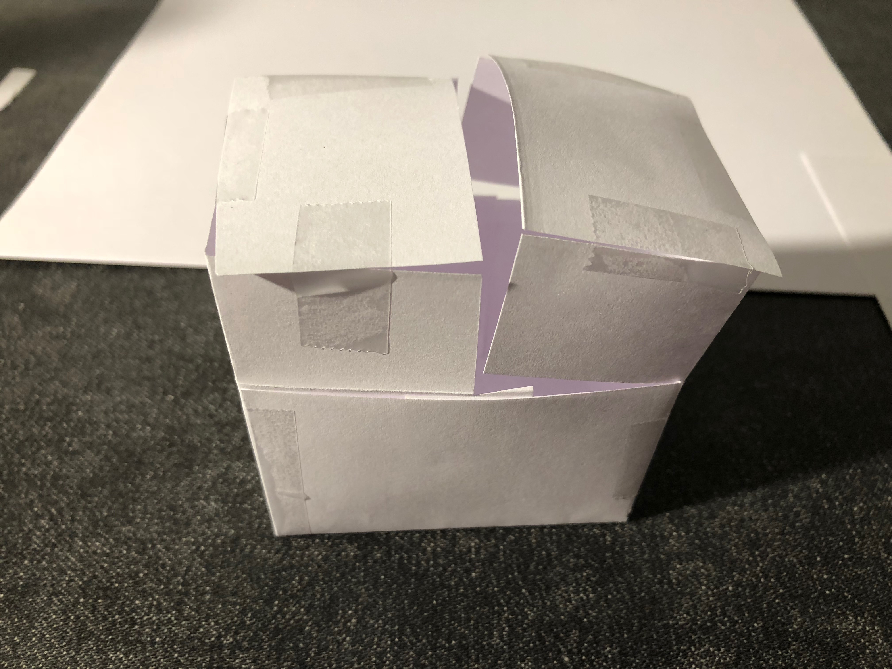
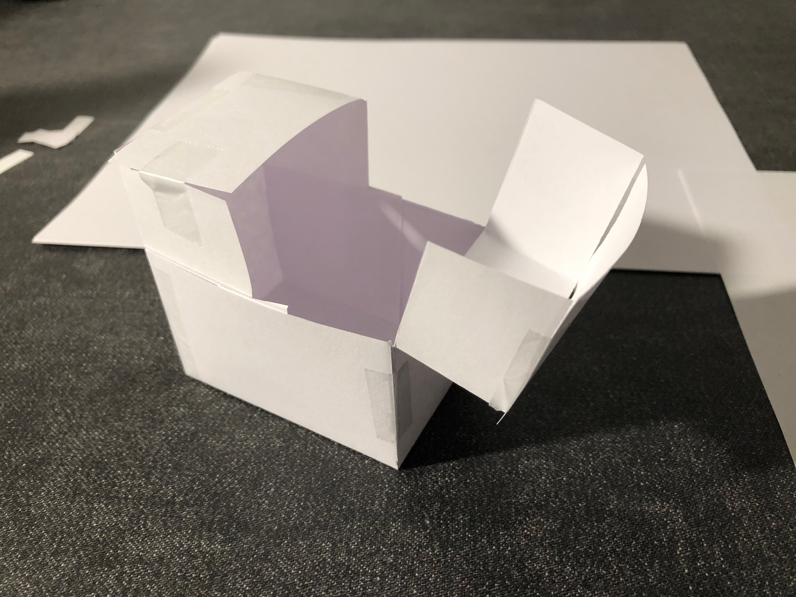

# Lab 5 Prep for Oct 2

Devon Bain (dwb264)

1. See video and photos below.

2. The switch will go on the part of the lid that does not hinge open. The servo and arm will be attached to the underside of that part of the lid. The Arduino can remain attached to the breadboard by cutting a small hole in the box and running wires through it.

3. Paper prototype photos and video:

[Link to timelapse video](https://youtu.be/bC4d6PMF-2I)

