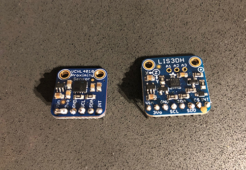

# Lab Prep for Lab 3, Sep 13

Devon Bain (dwb264)

## Pre-soldering

Please note, I accidentally soldered 2 of the connectors together on the proximity sensor - I'll need help to fix this.

## Data logger ideas

