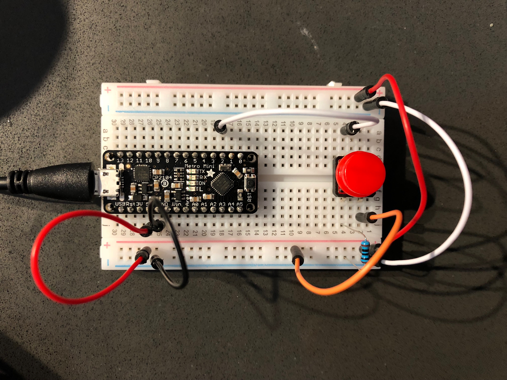
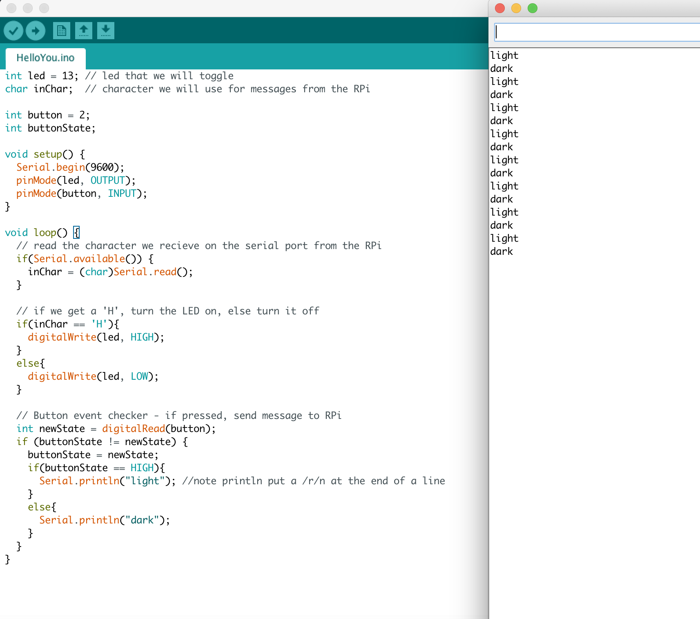

# Lab Prep for Lab 7, Oct 18

Devon Bain (dwb264)

## Button Circuit

## HelloYou.ino

The code turns the light on and logs "light" to the serial monitor when the button is pressed. It logs "dark" when the button is released.

